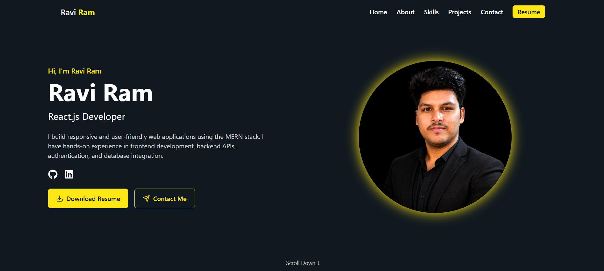

# Ravi Ram Portfolio

A responsive and interactive personal portfolio website built with React, Vite, and Tailwind CSS. It showcases professional experience, education, skills, projects, GitHub stats, and contact details.

## Table of Contents

* [Demo](#demo)
* [Features](#features)
* [Navigation](#navigation)
* [Project Data](#project-data)
* [Skills](#skills)
* [Tech Stack](#tech-stack)
* [Getting Started](#getting-started)
* [File Structure](#file-structure)
* [Customization](#customization)
* [Deploy](#deploy)


## Demo



## Features

* Fully responsive layout for desktop and mobile
* Fixed top navbar with smooth section scrolling
* Conditional `Live Demo` project button rendering when demo URL exists
* Resume button opens in a new tab and triggers file download
* About section groups education and experience
* Skills section includes both technical and soft skills
* Projects showing image, description, tags, GitHub link, and optional demo link
* GitHub stats section shows recent GitHub metrics
* Contact form and footer

## Navigation

Navbar items:

1. Home (#hero)
2. About (#about)

   * Education (#education)
   * Experience (#experience)
3. Skills (#skills)
4. Projects (#projects)
5. GitHub (#github)
6. Contact (#contact)
7. Resume (downloads `Ravi_Ram.pdf` as a new tab)

## Project Data

* At least 4 projects are defined in `src/components/ProjectSection.jsx`
* Each project has:

  * `title`
  * `description`
  * `image`
  * `tags`
  * `githubLink`
  * Optional `demoLink`


## Skills

`src/components/SkillsSection.jsx` supports categories:

* Frontend
* Backend
* Database
* Tools
* Soft Skills (e.g., Attention to Detail, Time Management, Communication, Adaptability, Problem Solving, Teamwork)

## Tech Stack

* React 18
* Vite
* Tailwind CSS
* Lucide React Icons
* Framer Motion
* Devicon Icon Fonts

## Getting Started

### 1. Clone Repository

```bash
git git clone https://github.com/mrrobot459/portfolio.git
cd <your-repository-name>
```

### 2. Install Dependencies

```bash
npm install
```

### 3. Run Development Server

```bash
npm run dev
```

### 4. Open in Browser

```
http://localhost:5173
```

### 5. Build for Production

```bash
npm run build
```

### 6. Preview Production Build

```bash
npm run preview
```

## File Structure

```text
src/
├── assets/
│   └── Ravi_Ram.pdf
├── components/
│   ├── Navbar.jsx
│   ├── HeroSection.jsx
│   ├── EducationSection.jsx
│   ├── ExperienceSection.jsx
│   ├── SkillsSection.jsx
│   ├── ProjectSection.jsx
│   ├── GithubStatsSection.jsx
│   ├── ContactSection.jsx
│   └── Footer.jsx
├── pages/
│   └── Index.jsx
├── App.jsx
└── main.jsx
```

## Customization

* Update navigation links in `Navbar.jsx`
* Edit skills in `SkillsSection.jsx`
* Add or remove projects in `ProjectSection.jsx`
* Update education and experience in their respective sections
* Customize colors in `src/index.css` or `App.css`
* Replace `Ravi_Ram.pdf` with your latest resume if needed

## Deploy

You can deploy this portfolio on:

* Netlify
* Vercel
* GitHub Pages

After building the project:

```bash
npm run build
```

Upload the generated `dist/` folder to your preferred hosting platform.


